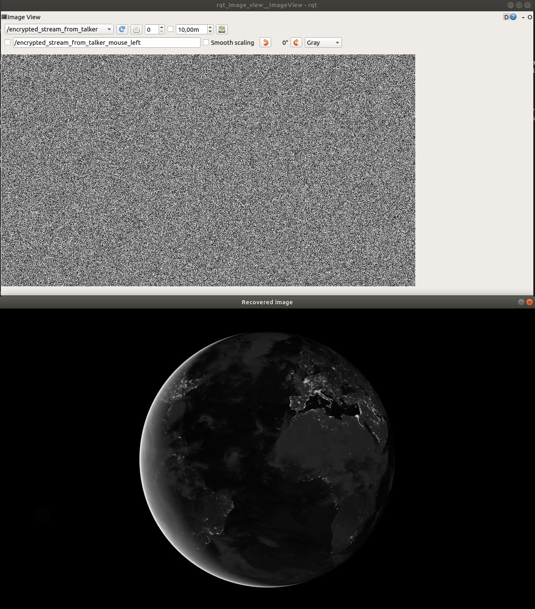

# Real-time encryption of sensors in autonomous systems

## Overview
This repo contains source code and instructions to interface C++ implemetations of [cryptographical algorithms](https://github.com/pettsol/CryptoToolbox) for different sensor data such as images / video stream, point cloud and control signals. By following the instructions, you should be able to create an efficient pipeline to transfer different types of sensor data securely across machines. I.e, sensor data is encrypted during transfer and only decrypted at end-points. Authentication algorithms from the toolbox is also included to ensure that data is not changed during transfer.

We use Robot Operating System (ROS) as a software platform to handle sensor interfacing and low-level communication between nodes (either locally on one single machine or across multiple machines). This simplfies the task of applying the cryptological toolbox of algorithms for different sensor data significantly. Fortunately, ROS also offers point cloud libraries to interface and visualize lidar data. In addition, we use OpenCV to interface image data for encryption/decryption operations. I.e. turning high-level images into serialized data to fit input buffers and vice versa, deserialize the data from output buffers into high-level images. 
 
This repo is in fact a ROS package which can easily be integrated into a ROS environment applied by new users. It is tested with Ubuntu 18.04 LTS and ROS melodic, both on x86 architecture (standard laptop) and arm-based 64-bit architecture (Nvidia Jetson Xavier). In the src folder, each application folder is listed and under each application folder, each cryptological method in use is listed. In CMakeLists.txt, one can easily comment / uncomment executives representing the different cryptological methods applied to different sensor data (video, pointcloud or control signals). Remember to only include one pair of executive at the time ("talker" - the ROS node to send data and "listener" the ROS node to receive data). For simplicity, all internal crypto libraries neccessary for each application is stored locally. This may be changed later. 

## Examples

Two applications is shown below. First, encrypted video stream as well as recovered video at end-points using AES 128-bit in cipher feedback mode.

 Then, the second screenshot shows the recovered point cloud using HC-128 and authentication (HMAC-SHA-256). We have not found any way to visualize an encrypted point cloud yet. However, original point cloud data is printed to the upper terminal while its encrypted point version is shown in the lower one.  

## Installation

### Dependencies
This software is built on ROS, which needs to be installed first.

- If you use a standard PC with x86 architecture, follow the instructions here: http://wiki.ros.org/melodic/Installation/Ubuntu. Full-desktop version is recommended if disk-space is not critical.

- For arm-based Nvidia Jetson Xavier:

      git clone https://github.com/jetsonhacks/installROSXavier
      cd installROSXavier
      ./installROS.sh -p ros-melodic-desktop-full
      
This repo also provide a quick solution to setup a catkin workspace by running the command:

	./setupCatkinWorkspace.sh
	
More instructions on how to setup a Nvidia Jetson Xavier from scratch is included in the documentation folder. Here, some aspects to consider when sending ROS messages across multiple machines is also included. 

In addition, to be able to run the image/video encryption examples, this ROS package depends on the following software:

- [OpenCV](http://opencv.org/) (computer vision library)

For standard laptops, installation instructions from here is recommended: https://www.pyimagesearch.com/2018/05/28/ubuntu-18-04-how-to-install-opencv/.

For Jetson Xavier:

    git clone https://github.com/AastaNV/JEP
    cd scripthttp://docs.ros.org/melodic/api/sensor_msgs/html/msg/Image.html
    ./install_opencv4.1.1_Jetson.sh.

NB: There has been some issues when combining ROS melodic and OpenCV 4.x.x, so it may be more safe to install OpenCV <= 3.4.x. We installed 3.4.3 by simply changing 4.1.1 with 3.4.3 everywhere in the sh file.

Now, create a catkin workspace and include our ROS package as well as ROS package for bridging opencv and ROS (vision_opencv):

    mkdir -p catkin_ws/src
    cd catkin_ws/src
    git clone https://github.com/oysteinvolden/Real-time-sensor-encryption.git
    git clone https://github.com/ros-perception/vision_opencv.git 
    cd ..
    catkin_make -DCMAKE_BUILD_TYPE=Release

Building in release mode makes sure you maximize performance. 

## Basic Usage

### Run the publisher and the subscriber

Open a terminal and type:

    roscore
Open a second terminal and:
	
    cd ~/catkin_ws
    source devel/setup.bash
    rosrun crypto_pipeline talker
Open a third terminal and:

    cd ~/catkin_ws
    source devel/setup.bash
    rosrun crypto_pipeline listener

Remember to enable the pair of executives in use and uncomment all other executives. These are found in CMakelists.txt inside the crypto_pipeline folder. 

### ROS topics

**Images**

* **`/encrypted_stream_from_talker`** ([sensor_msgs/Image])

* **`/encrypted_stream_from_listener`** ([sensor_msgs/Image])

    Encrypted image topics sent between nodes. Documentation is found [here](http://docs.ros.org/melodic/api/sensor_msgs/html/msg/Image.html). 
    We dont publish recovered images since they can be visualized using openCV's libraries. 

**Point cloud**

* **`/os1_cloud_node/points`** ([sensor_msgs/Pointcloud2])

    Original point cloud topic played from a rosbag. Rosbag is a powerful ROS tool used to record sensor measurements, in this case raw point cloud data from a lidar. 

* **`/encrypted_points_from_talker`** ([sensor_msgs/Pointcloud2])

* **`/recovered_points_listener`** ([sensor_msgs/Pointcloud2])

* **`/encrypted_points_from_listener`** ([sensor_msgs/Pointcloud2])

* **`/recovered_points_talker`** ([sensor_msgs/Pointcloud2])

    Encrypted and recovered point cloud topics. Documentation is found [here](http://docs.ros.org/melodic/api/sensor_msgs/html/msg/PointCloud2.html).

**Control signals**

- ROS topics for control signals comes later

### Handy ROS tools
	
Check topics pulished:

    rostopic list -v
Check content of topics published:

    rostopic echo /topic_name
Check frequency:

    rostopic hz /topic_name
Visualize image topic:

    rqt_image_view
Visualize point cloud:

    rviz
    change frame to "os1_lidar"

**Credit: The ROS package is heavily based on the [toolbox](https://github.com/pettsol/CryptoToolbox) containing C-style cryptographical algorithms implemented by [Petter Solnoer](https://www.ntnu.no/ansatte/petter.solnor).**

**Authors: [Oystein Volden](https://www.ntnu.no/ansatte/oystv), oystein.volden@ntnu.no and [Petter Solnoer](https://www.ntnu.no/ansatte/petter.solnor), petter.solnor@ntnu.no**
